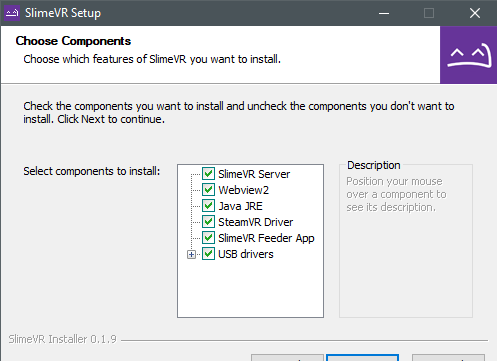

# Initial Setup {#initial-setup}

This guide should help you with installing the SlimeVR Server and getting things setup so that everything is functioning as it should.

## Install the Latest SlimeVR Installer {#install-the-latest-slimevr-installer}
The latest [SlimeVR Installer can be found here.](https://slimevr.dev/download) Download it and install it, this installer can be used to update the server software in the future.

Bear in mind, if you plan on using the server purely for [standalone usage via OSC](osc-information.md), and not PC VR via SteamVR, you can de-select **SteamVR Driver**, **SlimeVR Feeder App**, and **USB drivers**. If you don't already have SteamVR installed and have launched it previously, you may encounter an error.

## Test Your Trackers {#test-your-trackers}
Turn each tracker on and see if they work.

Each tracker should blink an LED briefly on startup, and then blink every few seconds to indicate its status as follows:

| Number of blinks | Status                                             |
| :--------------: |:-------------------------------------------------- |
| 1                | Tracker is ready                                   |
| 2                | Connecting to SlimeVR server                       |
| 3                | Connecting to wifi                                 |
| 5                | IMU error                                          |

If a tracker doesn't start up, try charging it. Connect the tracker via USB port to your PC or any USB charger. A red LED light should light up to indicate that it's charging. A green LED or blue LED light means it's fully charged (LED might be a different colour depending on your charging board). Try turning the tracker on during charging to see if it works.

**Please note that as a rule, DIY trackers should be kept off while charging outside of this specific case.**

## IMU Calibration {#imu-calibration}

If you have MPU6050 or MPU6500-based trackers, make sure that when you turn on your tracker it's lying on a flat surface. The sensors need to calibrate for 20-30 seconds in a stable environment. This should be done every time you turn on your trackers. Failing to do so will result in an increased rate of drift.

If you have MPU9250, BMI160, or MPU+QMC5883L-based tracker you need to calibrate the IMU before it will work correctly. This calibration only needs to be done once. You can only calibrate one IMU at a time, so if you have any extensions, they will also need to be calibrated.

To calibrate your IMU:
1. Plug in your microcontroller (D1 Mini, NodeMCU, or other)
1. Open the SlimeVR server, and click **Settings**, and then click **Serial Console** under **Utilities**.
1. Flip the IMU you want to calibrate upside down and press the reset button on your micro controller. You should see a message indicating that you need to flip the IMU right side up to begin calibration.
1. Upon flipping the IMU over, calibration should begin. To successfully calibrate your IMU you need to gently rotate the IMU in all 3 axes.
1. After approximately 60 seconds has passed, the tracker should be successfully calibrated and will begin to show rotation in the SlimeVR server.

Other IMUs, such as the BNO085 or ICM20948 do not require any specific manual calibration and can be used immediately.

## Check that the Driver Loads and Connects {#check-that-the-driver-loads-and-connects}

1. Start SteamVR, go to **Settings** > **Manage Add-Ons**. Check if SlimeVR exists here, set it to **On**.

   
1. Start the SlimeVR Server through the start menu via the "SlimeVR Server" shortcut.
1. Restart SteamVR. Now you should see 3 trackers active in SteamVR:

   
1. In SlimeVR Server, you should see the rotation change for your headset and controllers as you move them around:

   

*Created by Eiren, edited by adigyran#1121, CalliePepper#0666, Emojikage#3095 and NWB#5135, styled by CalliePepper#0666.*
